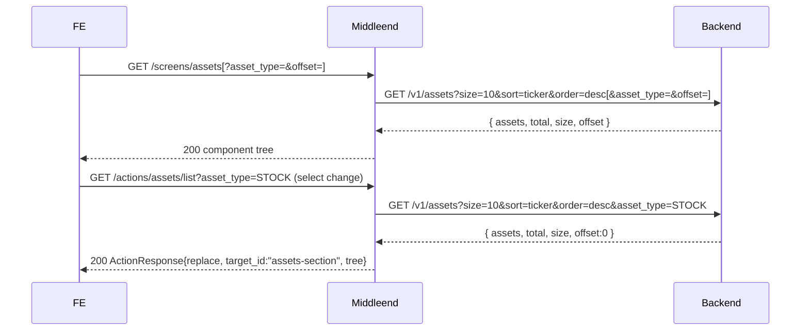

# Assets — Layer 1: List

First iteration of the assets screen. Read-only: paginated list of registered assets with an `asset_type` filter. No create/edit/delete — those land in Layer 2.

This is the **first of two layers** for the assets screen (see `spec/screens/assets/`):

1. **List** — paginated table + `asset_type` filter (this spec).
2. Mutations — create (FAB + form drawer), edit (dialog), delete (with force-delete fallback). TBD.

Scope for L1:
- Web-only tree. Other platforms receive the same tree (responsive cards come later).
- Fixed server-side sort: `ticker DESC`. No interactive sort column.
- No CTA in empty state (the "Create asset" button belongs to L2).

## Endpoints

| Method | Path | Auth | Description |
|--------|------|------|-------------|
| GET | `/screens/assets` | yes | Assets screen component tree. Reads optional query `asset_type`, `offset` for deep-linking. |
| GET | `/actions/assets/list` | yes | Returns an `ActionResponse{replace, target_id:"assets-section", tree}` that re-renders filter + table + pagination. Idempotent read. |

Headers read (both endpoints):
- `Authorization: Bearer <token>` — required. Forwarded to the backend.
- `Accept-Language` — default `en`.
- `X-Platform` — only `web` is meaningfully supported in L1.

Downstream call: `GET /v1/assets?size=10&sort=ticker&order=desc[&asset_type=…][&offset=…]`.

## Flow



## Frontend interactions

All interactive controls live inside the `assets-section` subtree — the only part that gets replaced.

- **Filter change** — the `asset-type-select` carries a `submit` action with `method:"GET"`, endpoint `/actions/assets/list`, `target_id:"assets-filter-form"`. The FE serializes the form as query string and GETs. No `offset` in the form → the handler defaults `offset` to `0` (filter change resets pagination).
- **Pagination** — the prev/next buttons carry a `reload` action (GET) with a URL that bakes in the current `asset_type` and the target offset: `/actions/assets/list?asset_type=<v>&offset=<n>`.

Both interactions end up as GETs to the same endpoint with the same query shape.

## Component tree

```
screen id=assets props={ title: i18n "assets.title" }
  column assets-root (gap=lg)
    column assets-section (gap=sm)              ← replaceable subtree
      form assets-filter-form
        row assets-filter-row widths=["240px","1fr"]
          select asset-type-select
            props: name="asset_type", label=i18n "assets.filter.type",
                   default_value=<current asset_type or "">
            options:
              { value:"",       label: i18n "assets.filter.type_any" }
              { value:"STOCK",  label:"STOCK"  }
              { value:"ETF",    label:"ETF"    }
              { value:"CRYPTO", label:"CRYPTO" }
              { value:"BOND",   label:"BOND"   }
            actions: [{
              trigger:"change", type:"submit", method:"GET",
              endpoint:"/actions/assets/list",
              target_id:"assets-filter-form",
              loading:"section"
            }]
          spacer filter-spacer size="none"      ← fills the 1fr column
      table assets-table
        columns:
          { id:"ticker",         header:i18n "assets.col.ticker",          width:"120px" }
          { id:"name",           header:i18n "assets.col.name",            width:"1fr"   }
          { id:"type",           header:i18n "assets.col.type",            width:"100px" }
          { id:"currency",       header:i18n "assets.col.currency",        width:"100px" }
          { id:"complex",        header:i18n "assets.col.complex",         width:"100px", align:"center" }
          { id:"price_provider", header:i18n "assets.col.price_provider",  width:"160px" }
        children: table_row asset-<id>  (one per asset)
          text ticker           (uppercase, weight:bold, size:sm)
          text name             (size:sm)
          text type             (size:sm)
          text currency         (size:sm)
          text complex          ("✓" if is_complex else "—", size:sm)
          text price_provider   (value or "—"; "—" also when is_complex, size:sm)
      row assets-pagination widths=["auto","1fr","auto"] gap="md"
        button pagination-prev
          props: label=i18n "assets.pagination.prev", variant=secondary, style=ghost,
                 disabled: offset == 0
          actions: [{
            trigger:"click", type:"reload",
            endpoint: "/actions/assets/list?asset_type=<v>&offset=<prevOffset>",
            target_id: "assets-section", loading: "section"
          }]
        text pagination-info
          content: i18n "assets.pagination.page_of" {current, total}, size:sm, color:muted
        button pagination-next
          props: label=i18n "assets.pagination.next", variant=secondary, style=ghost,
                 disabled: offset + size >= total
          actions: [{
            trigger:"click", type:"reload",
            endpoint: "/actions/assets/list?asset_type=<v>&offset=<nextOffset>",
            target_id: "assets-section", loading: "section"
          }]
```

The pagination row is omitted when `total <= size`.

## Empty state

When the backend returns `assets: []`:

```
column assets-section (gap=sm)
  form assets-filter-form ...                  ← kept, so the user can change/clear the filter
  column assets-empty (gap=xs)
    text empty-title    → i18n key, size:lg, weight:bold
    text empty-subtitle → i18n key, size:md, color:muted
```

- No filter active (`asset_type == ""`): keys `assets.empty_title` / `assets.empty_subtitle`.
- Filter active (`asset_type != ""`): keys `assets.empty_filtered_title` / `assets.empty_filtered_subtitle`.

No CTA buttons in L1. The "Create asset" entry point arrives with L2.

## Formatting and null handling

| Field | Render | Notes |
|---|---|---|
| `ticker` | uppercase (BE already guarantees) | — |
| `name` | as-is | — |
| `asset_type` | as-is (`STOCK` / `ETF` / `CRYPTO` / `BOND`) | — |
| `currency` | uppercase 3-char ISO code | — |
| `is_complex` | `"✓"` when `true`, `"—"` when `false` | — |
| `price_provider` | value as-is (e.g. `TWELVE_DATA`); `"—"` when `null` or `is_complex` | — |

L1 has no currency, percentage, or date values — the locale formatter does not apply. The only i18n content is headers, the filter label, pagination labels, and empty-state strings.

## Sort

Fixed server-side: `sort=ticker&order=desc`. Not configurable from the UI in L1.

## Pagination math

- `size` is `10` (hardcoded for L1).
- `page = (offset / size) + 1` (1-based for display).
- `total_pages = ceil(total / size)`. When `total == 0`, the pagination row is omitted.
- `prevOffset = max(0, offset - size)`.
- `nextOffset = offset + size`.
- `pagination-info` uses the `assets.pagination.page_of` key with `{current}` and `{total}` placeholders.

## Query parameter rules

- `asset_type`: optional. Valid values: `""` (empty = no filter), `STOCK`, `ETF`, `CRYPTO`, `BOND`. Missing or empty → no filter sent to the backend.
- `offset`: optional. Non-negative integer. Default `0`. Forwarded to backend as-is.
- Unknown extra query params are ignored.

## i18n keys introduced

Added to `locales/en.json` and `locales/es.json`:

| Key | en | es |
|---|---|---|
| `assets.title` | Assets | Activos |
| `assets.filter.type` | Type | Tipo |
| `assets.filter.type_any` | Any | Todos |
| `assets.col.ticker` | Ticker | Ticker |
| `assets.col.name` | Name | Nombre |
| `assets.col.type` | Type | Tipo |
| `assets.col.currency` | Currency | Moneda |
| `assets.col.complex` | Complex | Complejo |
| `assets.col.price_provider` | Price Provider | Proveedor |
| `assets.pagination.prev` | Previous | Anterior |
| `assets.pagination.next` | Next | Siguiente |
| `assets.pagination.page_of` | `Page {current} of {total}` | `Página {current} de {total}` |
| `assets.empty_title` | No assets registered yet | Aún no hay activos |
| `assets.empty_subtitle` | Once you register assets, they will appear here. | Cuando registres activos, aparecerán aquí. |
| `assets.empty_filtered_title` | No assets match the filter | Ningún activo coincide con el filtro |
| `assets.empty_filtered_subtitle` | Try changing or clearing the filter. | Probá cambiar o limpiar el filtro. |

## Error handling

Applies to both `GET /screens/assets` and `GET /actions/assets/list`.

| Situation | HTTP | Body |
|---|---|---|
| Missing / invalid / expired JWT | 401 | `{"error":"unauthorized","redirect":"/login"}` |
| Backend returns 401 downstream | 401 | same |
| Backend 5xx or network error | 502 | `{"error":{"code":"BACKEND_ERROR","message":"..."}}` |
| Backend returns unexpected shape | 502 | same |
| Invalid query param (`asset_type` not in the allowed set, `offset` non-integer or negative) | 400 | `{"error":{"code":"BAD_REQUEST","message":"..."}}` |

## Package layout

```
internal/assets/
  client.go              - Client.List(ctx, auth, params) (*ListResult, error)
  client_test.go
  types.go               - Asset, ListParams, ListResult
  builder.go             - BuildScreen + BuildAssetsSection + private sub-builders
  builder_test.go
  get_usecase.go         - GetUseCase.Execute + ExecuteSection
  get_usecase_test.go
  handler.go             - GET /screens/assets, plus parseListParams / parseLang
  handler_test.go
  list_handler.go        - GET /actions/assets/list (returns ActionResponse{replace})
  list_handler_test.go
```

Separation of concerns (same shape as `internal/portfolio/`):
- `client.go` — BE communication only; no SDUI imports.
- `builder.go` — SDUI tree construction. `BuildAssetsSection` is reused by both handlers.
- `get_usecase.go` — orchestrates `client` → `builder`.
- `handler.go` / `list_handler.go` — HTTP adapters: parse query, call the use case, write the response.

Pagination helpers are not extracted to `internal/shared` yet (YAGNI; trades and snapshots will motivate extraction later).

## Acceptance criteria

- [x] `GET /screens/assets` without `Authorization` returns `401 {"error":"unauthorized","redirect":"/login"}`.
- [x] With a valid JWT, the middleend issues `GET /v1/assets?size=10&sort=ticker&order=desc[&asset_type=…][&offset=…]` to the backend and forwards the `Authorization` header unchanged.
- [x] The response is a `screen` with `id: assets` and `props.title` resolved from `assets.title` for `Accept-Language`.
- [x] The tree contains `assets-section` with `assets-filter-form` (containing `asset-type-select`) and `assets-table` with the 6 columns in documented order.
- [x] `asset-type-select` carries `default_value` equal to the `asset_type` query param (or `""` when absent).
- [x] The action on `asset-type-select` is `{trigger:"change", type:"submit", method:"GET", endpoint:"/actions/assets/list", target_id:"assets-filter-form", loading:"section"}`.
- [x] `assets-table` has one `table_row` per asset; each row contains 6 `text` cells in order ticker/name/type/currency/complex/price_provider.
- [x] `is_complex=true` → cell `"✓"`; `is_complex=false` → cell `"—"`.
- [x] `price_provider` renders the value; `null` or `is_complex=true` → `"—"`.
- [x] When `total <= size`, the `assets-pagination` row is omitted.
- [x] When emitted, pagination has `pagination-prev` (disabled when `offset==0`), `pagination-info` with localized `Page X of Y`, and `pagination-next` (disabled when `offset+size >= total`).
- [x] Pagination buttons carry `reload` actions with `asset_type` baked into the URL and the correct target offset.
- [x] `GET /actions/assets/list` with a valid JWT returns `ActionResponse{action:"replace", target_id:"assets-section", tree:<assets-section>}`.
- [x] Invalid `asset_type` (not in the accepted set) → `400 BAD_REQUEST`. Empty string is valid.
- [x] Invalid `offset` (non-integer or negative) → `400 BAD_REQUEST`.
- [x] Empty list without filter → `assets-empty` with keys `assets.empty_title` / `assets.empty_subtitle`.
- [x] Empty list with filter → `assets-empty` with keys `assets.empty_filtered_title` / `assets.empty_filtered_subtitle`.
- [x] Backend 5xx → `502 BACKEND_ERROR`; backend 401 → `401 unauthorized` with redirect.
- [x] All user-visible strings resolve via i18n (`en` / `es`); no hardcoded literals in the response.
