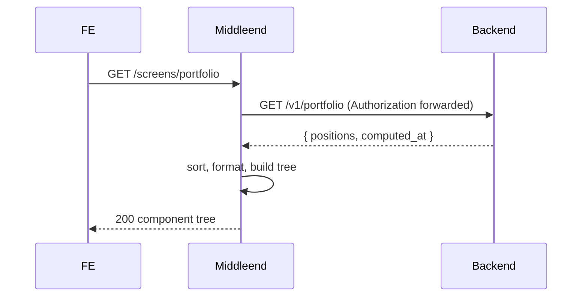

# Portfolio — Layer 1: Positions

First iteration of the portfolio screen. Renders a summary with the **Total Value** and a table with **all 11 columns per position**. Web-only tree for this layer; other platforms return the same tree (to be refined in a future polish layer).

This is the **first of six layers** for the portfolio screen (see `spec/screens/portfolio/`):

1. **Positions** — summary (Total Value only) + positions table (this spec).
2. Summary — five stat cards (Total Value, Total P&L, Performance, Snapshot Change, Open Positions).
3. Include-closed toggle — first interactive control.
4. Charts — Value Over Time and Asset Value Over Time.
5. Live mode.
6. Polish — HideValues toggle, responsive mobile cards, price source dots.

## Endpoint

| Method | Path                  | Auth | Description                              |
|--------|-----------------------|------|------------------------------------------|
| GET    | `/screens/portfolio`  | yes  | Portfolio screen component tree          |

Headers read:
- `Authorization: Bearer <token>` — required. Forwarded to the backend on the downstream call.
- `Accept-Language` — default `en`.
- `X-Platform` — for this layer only `web` is supported. Other platforms receive the same web tree.

## Flow



## Component tree

```
screen id=portfolio props={ title: "Portfolio" (i18n) }
  column portfolio-root (gap=lg)
    column portfolio-summary (gap=sm)
      text summary-label     → i18n "portfolio.total_value", size=sm, color=muted
      column total-values    → one text per currency
        text total-value-USD → "$12,345.67", size=xl, weight=bold
        text total-value-EUR → "€1,234.56", size=xl, weight=bold   (only when multi-currency)
    column positions-table (gap=sm)
      row positions-header widths=[<11>]
        text col-ticker         → i18n "portfolio.col.ticker", weight=bold
        text col-name           → ...
        text col-type           → ...
        text col-quantity       → ...
        text col-avg-cost       → ...
        text col-total-cost     → ...
        text col-market-value   → ...
        text col-unrealized-pnl → ...
        text col-pnl-pct        → ...
        text col-realized-pnl   → ...
        text col-last-snapshot  → ...
      list positions-body
        list_item position-<asset_id>
          row position-<asset_id>-row widths=[<same 11 widths>]
            text ticker          → uppercase, e.g. "AAPL"
            text name            → e.g. "Apple Inc"
            text type            → e.g. "STOCK"
            text quantity        → e.g. "10" or "—"
            text avg-cost        → e.g. "$153.33" or "—"
            text total-cost      → e.g. "$1,533.33" or "—"
            text market-value    → e.g. "$1,855.00" or "—"
            text unrealized-pnl  → e.g. "+$321.67" (color=positive) or "-$85.00" (color=negative) or "—"
            text pnl-pct         → e.g. "+21.00%" (color=positive) or "—"
            text realized-pnl    → e.g. "+$175.00" (color=positive) or "—"
            text last-snapshot   → e.g. "2 days ago" (i18n) or "—"
        (one list_item per position)
```

Column widths (proposed; the middleend emits them as `row.widths` which remain free-form per the SDUI contract):

```
["80px",   // ticker
 "1fr",    // name
 "80px",   // type
 "80px",   // quantity
 "110px",  // avg cost
 "110px",  // total cost
 "120px",  // market value
 "130px",  // unrealized pnl
 "80px",   // % pnl
 "120px",  // realized pnl
 "120px"]  // last snapshot
```

## Sort order

Positions are sorted by `current_value DESC` (nulls last), then `ticker ASC`. This order is fixed for layer 1 — interactive sort is out of scope.

## Formatting

All user-facing values are formatted server-side per `Accept-Language`. Raw numeric values are never returned.

| Field type      | Example `en`       | Example `es`        | Null rendering |
|-----------------|--------------------|---------------------|----------------|
| Currency        | `"$1,234.56"`      | `"$1.234,56"`       | `"—"`          |
| Quantity        | `"10"` / `"10.5"`  | `"10"` / `"10,5"`   | `"—"`          |
| Signed currency | `"+$321.67"` / `"-$85.00"` | `"+$321,67"` / `"-$85,00"` | `"—"` |
| Percentage      | `"+12.34%"` / `"-12.34%"` | `"+12,34%"` / `"-12,34%"` | `"—"` |
| Relative date   | `"2 days ago"`     | `"hace 2 días"`     | `"—"`          |
| Asset type      | `"STOCK"` (unchanged) | same              | `"—"`          |

Complex assets and fields dependent on a missing snapshot render as `"—"` following the backend's own null semantics.

Currency symbol is derived from the position's `currency` field (e.g. `USD` → `$`, `EUR` → `€`). Decimal places: 2 for currency and percentages, variable for quantity (strip trailing zeros).

## Color for P&L

Applied to `unrealized_pnl`, `pnl_pct`, `realized_pnl` text components:

- `value > 0` → `color: "positive"`.
- `value < 0` → `color: "negative"`.
- `value == 0` or `null` → no color (default).

The `error` token is reserved for validation / system failures; it is not used here.

## Total Value computation

- Sum `current_value` per currency across all positions where `current_value != null`.
- Emit one `text` line per currency, in descending total order.
- If all positions have `null` `current_value` (no snapshots at all), the column `total-values` contains a single `text` rendering `"—"`.

## Sort algorithm (middleend)

Stable sort with this comparator:

1. Positions with non-null `current_value` come before those with null (descending by value).
2. Among null `current_value` positions, sort by `ticker` ascending.
3. Among non-null `current_value` positions, ties are broken by `ticker` ascending.

## Empty state

When the backend returns `positions: []`:

```
screen id=portfolio
  column portfolio-root (gap=lg)
    column portfolio-empty
      text empty-title    → i18n "portfolio.empty_title", size=lg, weight=bold
      text empty-subtitle → i18n "portfolio.empty_subtitle", size=md, color=muted
```

No call-to-action buttons in this layer — deferred until `/screens/trades` and `/screens/snapshots` exist.

## Error handling

| Situation                                | HTTP status from middleend | Body                                                  |
|------------------------------------------|----------------------------|-------------------------------------------------------|
| Missing / invalid / expired JWT          | 401                        | `{"error":"unauthorized","redirect":"/screens/login"}` |
| Backend returns 401 on the downstream call | 401                      | `{"error":"unauthorized","redirect":"/screens/login"}` |
| Backend 5xx or network error             | 502                        | `{"error":{"code":"BACKEND_ERROR","message":"..."}}`  |
| Backend returns unexpected shape         | 502                        | same                                                  |

The frontend shows a retry UI for 5xx and issues a fresh `GET /screens/portfolio` when the user retries.

## Login redirect update

Once this layer is live, the login success `navigate` target changes from `/screens/home` to `/screens/portfolio`. The shell's nav item for `portfolio` already points at `/screens/portfolio` (no change there).

## i18n keys introduced

Added to `locales/en.json` and `locales/es.json`:

| Key                         | en                    | es                                  |
|-----------------------------|-----------------------|-------------------------------------|
| `portfolio.title`           | Portfolio             | Portafolio                          |
| `portfolio.total_value`     | Total Value           | Valor total                         |
| `portfolio.empty_title`     | No positions yet      | Aún no hay posiciones               |
| `portfolio.empty_subtitle`  | Register your first trade or snapshot. | Registrá tu primer trade o snapshot. |
| `portfolio.col.ticker`      | Ticker                | Ticker                              |
| `portfolio.col.name`        | Name                  | Nombre                              |
| `portfolio.col.type`        | Type                  | Tipo                                |
| `portfolio.col.quantity`    | Quantity              | Cantidad                            |
| `portfolio.col.avg_cost`    | Avg Cost              | Costo prom.                         |
| `portfolio.col.total_cost`  | Total Cost            | Costo total                         |
| `portfolio.col.market_value`| Market Value          | Valor de mercado                    |
| `portfolio.col.unrealized_pnl` | Unrealized P&L      | G/P no realizada                    |
| `portfolio.col.pnl_pct`     | % P&L                 | % G/P                               |
| `portfolio.col.realized_pnl` | Realized P&L         | G/P realizada                       |
| `portfolio.col.last_snapshot` | Last Snapshot       | Último snapshot                     |
| `time.relative.seconds_ago` | `"{n} seconds ago"`   | `"hace {n} segundos"`               |
| `time.relative.minutes_ago` | `"{n} minutes ago"`   | `"hace {n} minutos"`                |
| `time.relative.hours_ago`   | `"{n} hours ago"`     | `"hace {n} horas"`                  |
| `time.relative.days_ago`    | `"{n} days ago"`      | `"hace {n} días"`                   |
| `time.relative.just_now`    | `"just now"`          | `"hace instantes"`                  |

## Package layout

```
internal/portfolio/
  builder.go              - BuildScreen(positions, lang) components.Component
  builder_test.go
  client.go               - Client for GET /v1/portfolio, forwards Authorization
  client_test.go
  get_usecase.go          - Execute(ctx, authHeader, lang) (components.Component, error)
  get_usecase_test.go
  handler.go              - GET /screens/portfolio
  handler_test.go
  format.go               - Money/Percent/Quantity/RelativeTime formatters per locale
  format_test.go
  sort.go                 - SortPositions(positions)
  sort_test.go
  types.go                - Position struct matching backend response
```

Separation of concerns:
- `client.go`: BE communication only.
- `format.go`: presentation; pure functions; no SDUI imports.
- `sort.go`: ordering; pure.
- `builder.go`: composes the SDUI tree using already-formatted strings.
- `get_usecase.go`: orchestrates client → sort → format → builder.
- `handler.go`: HTTP adapter; reads headers, calls the use case, writes the response.

## Acceptance criteria

- [ ] `GET /screens/portfolio` without `Authorization` returns `401 {"error":"unauthorized","redirect":"/screens/login"}`.
- [ ] With a valid JWT, the middleend issues `GET /v1/portfolio` to the backend and forwards the `Authorization` header unchanged.
- [ ] The response is a `screen` with `id: portfolio` and `props.title` set (metadata, i18n).
- [ ] The tree contains `portfolio-summary` with at least one `text` under `total-values` (or `"—"` if all values are null). Multi-currency portfolios produce one `text` per currency.
- [ ] The tree contains `positions-header` row with 11 `text` components in the documented order.
- [ ] The tree contains `list#positions-body`; its children are `list_item`s, one per position, each containing a `row` with 11 `text` components in the same order as the header.
- [ ] Positions are sorted by `current_value` DESC (nulls last), then `ticker` ASC.
- [ ] P&L values (`unrealized_pnl`, `pnl_pct`, `realized_pnl`) carry `color: "positive"` when `> 0`, `color: "negative"` when `< 0`, and no color when zero or null.
- [ ] Currency, percentage, quantity, and relative-time strings are formatted according to `Accept-Language` (`en` / `es`).
- [ ] Null backend fields render as `"—"`.
- [ ] Empty positions array produces a `portfolio-empty` block with a localized title and subtitle — no CTA buttons.
- [ ] Backend 5xx causes a `502 BACKEND_ERROR` response.
- [ ] Backend 401 causes a `401` with redirect to `/screens/login`.
