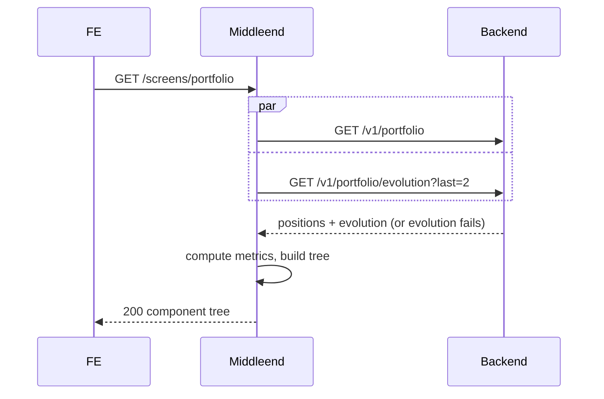

# Portfolio — Layer 2: Summary

Second iteration of the portfolio screen. Replaces the single Total-Value card from layer 1 with **five stat cards** (Total Value, Total P&L, Total Performance, Snapshot Change, Open Positions). Introduces a second backend call to `/v1/portfolio/evolution?last=2` for Snapshot Change. The positions table and its behavior are unchanged.

## Endpoint (unchanged)

| Method | Path                  | Auth | Description                              |
|--------|-----------------------|------|------------------------------------------|
| GET    | `/screens/portfolio`  | yes  | Portfolio screen component tree          |

## Flow



The two backend calls run in parallel. If `/v1/portfolio/evolution` fails but `/v1/portfolio` succeeds, the screen still renders — Snapshot Change falls back to `"—"` per currency. If `/v1/portfolio` fails, the screen fails with the same error handling as layer 1 (502 `BACKEND_ERROR`).

## Backend contract for Snapshot Change

`/v1/portfolio/evolution?last=N` returns the N most recent raw snapshot points per currency. Confirmed from the backend implementation: `last` is an integer 1..500, mutually exclusive with `points` and `raw`. (`last` and `raw` are not documented in `be_specs/api/portfolio.md` today; the backend spec should be updated separately — out of middleend scope.)

Each `EvolutionPoint` includes:
- `snapshot_id`, `recorded_at`, `is_full_snapshot`
- `total_value` (`"15420.50"`)
- `currency` (`"USD"`)
- `total_cost` may be present depending on backend version — not required by this layer.

## Component tree

The portfolio root now contains a row of five summary cards followed by the positions table from layer 1. The old single `portfolio-summary-row` (auto + 1fr spacer wrapping one card) is replaced.

```
screen id=portfolio props={ title }
  column portfolio-root (gap=lg)
    row portfolio-summary-row widths=["1fr","1fr","1fr","1fr","1fr"]
      card summary-card-total-value
      card summary-card-total-pnl
      card summary-card-performance
      card summary-card-snapshot-change
      card summary-card-open-positions
    card positions-table-card  (unchanged from layer 1)
      column positions-table (gap=sm)
        row positions-header widths=[11 cols]
        list positions-body
```

### Stat card structure

All five cards share the same shape:

```
card summary-card-<id>
  column summary-card-content-<id> (gap=sm)
    text  summary-label-<id>                → i18n label, size=sm, color=muted
    column summary-values-<id>
      text summary-value-<id>-<currency>    → formatted value, size=xl, weight=bold, optional color
      (one text per currency for monetary/ratio cards; one "—" text if no data)
      (a single text for Open Positions with no currency suffix)
```

For Open Positions the inner column contains exactly one `text` whose id is `summary-value-open-positions`.

## Cards — inputs, computation, formatting

Let `P` be the sorted positions array and `E` be the array of evolution points (possibly empty).

All monetary and ratio cards produce **one line per currency** present in the data. Line order within a card: by the card's natural sort (see below). `"—"` appears only when the card has no data at all for that currency.

### 1. Total Value

- Computation (per currency `c`): `Σ p.current_value for p in P if p.currency == c and p.current_value != nil`.
- Display: `FormatMoney(sum, c, lang)` — e.g. `"$12,345.67"`.
- Color: none.
- Line sort: currencies ordered by total value descending.
- Fallback: if no currency has any non-null `current_value`, a single `text` renders `"—"` (no currency id suffix; id `summary-value-total-value-empty`).
- Label key: `portfolio.total_value`.

### 2. Total P&L

- Computation (per currency `c`): `Σ unrealized_pnl (non-null) + Σ realized_pnl` for positions with `currency == c`.
- Display: `FormatSignedMoney(sum, c, lang)` — e.g. `"+$496.67"`, `"-$125.00"`, `"$0.00"`.
- Color: `positive` if `sum > 0`, `negative` if `sum < 0`, none if zero.
- Line sort: same currency order as Total Value (join on currency set and keep the same order).
- Fallback: if no positions exist for a currency, that currency is omitted. If no positions at all, Open Positions would be 0 → empty state triggers at the screen level.
- Label key: `portfolio.total_pnl`.

### 3. Total Performance

- Computation (per currency `c`): `Σ unrealized_pnl / Σ total_cost × 100` for positions where both values are non-null and `currency == c`.
- Display: `FormatSignedPercent(pct, lang)` — e.g. `"+12.34%"`, `"-5.68%"`.
- Color: `positive` if `pct > 0`, `negative` if `pct < 0`, none if zero.
- Line sort: same as Total Value / P&L.
- Fallback per currency: if `Σ total_cost == 0` or there are no eligible rows for that currency, emit `"—"` for that currency (id `summary-value-performance-<currency>`).
- Label key: `portfolio.performance`.

### 4. Snapshot Change

- Computation (per currency `c`): let `pts` be the points of `E` with `currency == c`, sorted by `recorded_at` ascending. If `len(pts) < 2`, result is nil. Otherwise: `(pts[last].total_value - pts[last-1].total_value) / pts[last-1].total_value × 100`.
- Display: `FormatSignedPercent(pct, lang)`.
- Color: same rule.
- Line sort: same currency order as the other cards.
- Fallback per currency: `"—"` when nil or division by zero.
- Label key: `portfolio.snapshot_change`.
- **Source**: `GET /v1/portfolio/evolution?last=2`. If this call fails, all Snapshot Change lines render `"—"` and no error surfaces to the user.

### 5. Open Positions

- Computation: `len(P)` — simple count, no currency grouping.
- Display: integer as-is (no locale separator needed — the count is expected to be small).
- Color: none.
- Label key: `portfolio.open_positions`.

## Currency order across cards

To keep lines visually aligned across cards, the currency order is determined once per tree build:

1. Compute the set `C` of currencies present in `positions` (excluding positions with nil `current_value`).
2. Sort currencies by Total Value descending.
3. Reuse this order in Total Value, Total P&L, Performance, and Snapshot Change.

A currency present only in `evolution` (i.e. had snapshots historically but no active positions now) does not appear in the summary — Snapshot Change for it is not shown.

## Empty state

If `len(positions) == 0`, the screen renders the layer 1 empty block and **no stat cards appear**. The behavior is unchanged from layer 1.

## Error handling

| Situation                                               | HTTP status | Behavior                                                     |
|---------------------------------------------------------|-------------|--------------------------------------------------------------|
| `/v1/portfolio` 401 (missing / invalid / expired token) | 401         | `{"error":"unauthorized","redirect":"/screens/login"}`       |
| `/v1/portfolio` 5xx or malformed                        | 502         | `{"error":{"code":"BACKEND_ERROR","message":"..."}}`         |
| `/v1/portfolio/evolution` 401                           | 401         | Same as above. Consistent with positions 401.                |
| `/v1/portfolio/evolution` 5xx or malformed              | 200         | Screen renders; Snapshot Change is `"—"` per currency. Logged. |

The positions call is the critical path. Evolution is best-effort.

## i18n keys introduced

| Key                         | en                    | es                      |
|-----------------------------|-----------------------|-------------------------|
| `portfolio.total_pnl`       | Total P&L             | G/P total               |
| `portfolio.performance`     | Total Performance     | Rendimiento total       |
| `portfolio.snapshot_change` | Snapshot Change       | Cambio último snapshot  |
| `portfolio.open_positions`  | Open Positions        | Posiciones abiertas     |

## Package layout (incremental on top of layer 1)

| File | Change | Responsibility |
|---|---|---|
| `internal/portfolio/evolution.go` | **new** | `EvolutionPoint` type + `ParseEvolution(body []byte) ([]EvolutionPoint, error)` |
| `internal/portfolio/evolution_test.go` | **new** | parsing edge cases |
| `internal/portfolio/summary.go` | **new** | `SummaryMetrics` type + `ComputeMetrics(positions, evolution) SummaryMetrics` — pure function, no SDUI |
| `internal/portfolio/summary_test.go` | **new** | multi-currency, signs, null handling, <2 points |
| `internal/portfolio/client.go` | modify | add `GetEvolutionLast(ctx, auth, n) ([]EvolutionPoint, error)` |
| `internal/portfolio/client_test.go` | modify | tests for the new method (forward header, 401, 5xx, parse error) |
| `internal/portfolio/get_usecase.go` | modify | fetch positions + evolution in parallel (`errgroup` or channel pattern), tolerate evolution failure |
| `internal/portfolio/get_usecase_test.go` | modify | parallel success, evolution partial failure, positions failure propagation |
| `internal/portfolio/builder.go` | modify | `buildSummary` rewritten to produce a row of five cards from `SummaryMetrics` |
| `internal/portfolio/builder_test.go` | modify | one test block per card + structural test for the row |
| `locales/en.json`, `locales/es.json` | modify | add the four new keys |

Separation of concerns stays tight: `evolution.go` mirrors `types.go`; `summary.go` is pure math; `builder.go` consumes both pre-computed structs.

## Scope explicitly out

- **Responsive layout.** The layer 2 tree targets `web` (five cards in a single row). Mobile / tablet (grid collapsing to 2 columns) is deferred to layer 6. The builder does not branch on `X-Platform` in this layer.
- **HideValuesToggle.** Layer 6.
- **Updating `be_specs/api/portfolio.md`** to document `?last=N` and `?raw=true` — backend team's responsibility.

## Acceptance criteria

- [ ] The tree contains `row#portfolio-summary-row` with five direct `card` children in the order: `summary-card-total-value`, `summary-card-total-pnl`, `summary-card-performance`, `summary-card-snapshot-change`, `summary-card-open-positions`.
- [ ] Each summary card contains a label `text` with `color: muted` and a `column` of value `text`s with size `xl`, weight `bold`.
- [ ] Total Value shows one line per currency, formatted as unsigned money, currencies sorted by total value descending.
- [ ] Total P&L shows one line per currency, formatted as signed money, `color: positive` when > 0, `color: negative` when < 0, no color when zero.
- [ ] Total Performance shows one line per currency, formatted as signed percent; `"—"` per currency when `Σ total_cost == 0` for that currency.
- [ ] Snapshot Change shows one line per currency, using the last two snapshot points per currency; `"—"` when fewer than two points.
- [ ] Open Positions shows a single line with the integer count of positions.
- [ ] The middleend issues `GET /v1/portfolio` and `GET /v1/portfolio/evolution?last=2` in parallel, both with the forwarded `Authorization`.
- [ ] If `/v1/portfolio/evolution` returns an error, the tree still renders and Snapshot Change falls back to `"—"` per currency.
- [ ] If `/v1/portfolio` returns 401 from the backend, the middleend returns `401 unauthorized + redirect /screens/login`.
- [ ] If `/v1/portfolio` returns 5xx, the middleend returns `502 BACKEND_ERROR`.
- [ ] Empty positions (`len == 0`) renders the existing layer 1 empty block; no summary cards are emitted.
- [ ] Currency order is consistent across all monetary/ratio cards in a single response.
- [ ] `ComputeMetrics` is a pure function covered by unit tests independent of the SDUI tree builder.
