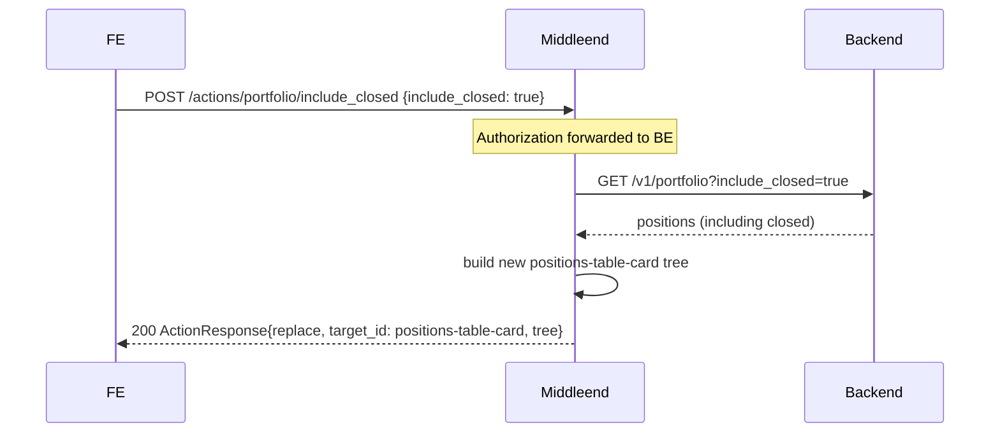

# Portfolio — Layer 3: Include-closed toggle

Third iteration of the portfolio screen. Adds an interactive checkbox above the positions table that, when toggled, **partially replaces** the positions table with one that also includes fully-closed positions (quantity == 0). The summary and the rest of the tree are untouched.

This is the first interactive control in the portfolio screen and the first use of the SDUI `submit` + `ActionResponse{replace}` partial-update pattern.

## Endpoint (new)

| Method | Path                                      | Auth | Description                                                                 |
|--------|-------------------------------------------|------|-----------------------------------------------------------------------------|
| POST   | `/actions/portfolio/include_closed`       | yes  | Reads `{include_closed: bool}`, returns an `ActionResponse` replacing the positions-table card |

Request body (JSON):

```json
{ "include_closed": true }
```

Response body on success (HTTP 200):

```json
{
  "action": "replace",
  "target_id": "positions-table-card",
  "tree": { "type": "card", "id": "positions-table-card", /* …full new table card… */ }
}
```

## Flow



The frontend replaces the subtree with id `positions-table-card` using the returned `tree`. The rest of the screen (summary row, the toggle itself, the screen `title`) remains untouched.

## Scope boundary

- The summary row does **not** refresh on toggle. Its metrics reflect the initial fetch of the screen. This is intentional: `Open Positions` is literally a count of currently open positions; including closed in the table is a view-only concern.
- The toggle state is **not persisted** across `GET /screens/portfolio` requests. Every fresh load of the screen starts with `include_closed: false`.

## Tree changes in `GET /screens/portfolio`

A new row is inserted between the summary row and the positions table:

```
screen id=portfolio
  column portfolio-root (gap=lg)
    row portfolio-summary-row       (unchanged)
    form include-closed-form
      row include-closed-row widths=["auto"]
        checkbox include-closed-checkbox
          props:
            name: "include_closed"
            label: i18n("portfolio.include_closed")
          actions:
            [{ trigger: "change", type: "submit",
               endpoint: "/actions/portfolio/include_closed", method: "POST",
               target_id: "include-closed-form" }]
    card positions-table-card       (unchanged initial content — only open positions)
```

The checkbox is **outside** `positions-table-card`. The action's `target_id` (`include-closed-form`) tells the frontend which subtree to read as form data. The `ActionResponse.target_id` in the server response (`positions-table-card`) tells the frontend which subtree to swap.

Initial `GET /screens/portfolio` calls `GET /v1/portfolio` with no `include_closed` param (same as today), so the checkbox starts unchecked.

## Handler behavior

### Input

Body (JSON):

```json
{ "include_closed": true }
```

`include_closed` is required and must be a boolean. Missing or non-bool → `400 BAD_REQUEST`.

The frontend's form serialization is expected to produce this shape. If the FE sends form-encoded instead of JSON, we accept both via Gin's `ShouldBind`.

### Processing

1. Read `Authorization` header; forward verbatim to the backend.
2. Call `GET /v1/portfolio?include_closed=<value>`.
3. Reuse the existing parse/sort pipeline (`Client.GetPositions` already returns `[]Position` — needs a variant that accepts `include_closed`).
4. Build the new positions-table card tree with `BuildPositionsTable(positions, lang, now) components.Component` (extracted from the existing private `buildTable`).
5. Wrap in an `ActionResponse{Action: "replace", TargetID: "positions-table-card", Tree: &card}` and return HTTP 200.

### Output

| Condition                                       | HTTP | Body                                                                                              |
|-------------------------------------------------|------|---------------------------------------------------------------------------------------------------|
| Success                                         | 200  | `ActionResponse{action: replace, target_id: "positions-table-card", tree: …}`                     |
| Malformed body / missing field                  | 400  | `{"error":{"code":"BAD_REQUEST","message":"..."}}`                                                 |
| Backend 401                                     | 401  | `{"error":"unauthorized","redirect":"/screens/login"}`                                             |
| Backend 5xx or network failure                  | 502  | `{"error":{"code":"BACKEND_ERROR","message":"..."}}`                                               |

## Client changes

`internal/portfolio/client.go` needs `include_closed` support. Two options considered:

- Add a new method `GetPositionsWithClosed(ctx, auth, includeClosed bool)`.
- Extend the existing `GetPositions` with an optional parameter.

Chosen: **extend the existing method** by making it accept a `bool`. Every call site changes, but the package only has two call sites (the use case for the screen, and the new handler). The signature becomes:

```go
func (c *Client) GetPositions(ctx context.Context, authorization string, includeClosed bool) ([]Position, error)
```

The screen's use case passes `false` (current behavior preserved for layer 1/2); the new action handler passes the parsed body value.

## Builder changes

Extract the private `buildTable` into an exported `BuildPositionsTable`:

```go
// BuildPositionsTable builds the card containing the positions header row and list.
// Returns a Card component with id "positions-table-card".
func BuildPositionsTable(positions []Position, lang string, now time.Time) components.Component
```

`BuildScreen` (used by the main GET handler) calls this function instead of its own private helper. The action handler calls the same function to build the replacement tree, guaranteeing identical shape.

## i18n keys introduced

| Key                           | en                          | es                         |
|-------------------------------|-----------------------------|----------------------------|
| `portfolio.include_closed`    | Include closed positions    | Incluir posiciones cerradas|

## Package layout (incremental on layer 2)

| File | Change | Responsibility |
|---|---|---|
| `internal/portfolio/client.go` | modify | `GetPositions` gains `includeClosed bool` parameter |
| `internal/portfolio/client_test.go` | modify | existing tests pass `false`; add test for `includeClosed=true` |
| `internal/portfolio/get_usecase.go` | modify | call passes `false` explicitly |
| `internal/portfolio/get_usecase_test.go` | modify | update `fakeFetcher` signature |
| `internal/portfolio/handler.go` | unchanged | still just the screen GET |
| `internal/portfolio/builder.go` | modify | extract `BuildPositionsTable`; insert the checkbox row in `BuildScreen` |
| `internal/portfolio/builder_test.go` | modify | assert the toggle row is present with the correct submit action; toggle sits outside positions-table-card |
| `internal/portfolio/include_closed_handler.go` | **new** | handles `POST /actions/portfolio/include_closed` |
| `internal/portfolio/include_closed_handler_test.go` | **new** | covers success, bad body, BE 401, BE 5xx |
| `internal/server/server.go` | modify | register protected route `POST /actions/portfolio/include_closed` |
| `locales/en.json`, `locales/es.json` | modify | add `portfolio.include_closed` |

## Scope explicitly out

- The summary row is not recomputed on toggle. That is the user's explicit call for this layer.
- Persistence (local storage, cookies, server-side user preference) — out of scope. Default to off on every fresh screen load.
- Responsive layout — layer 6.

## Acceptance criteria

- [ ] `GET /screens/portfolio` includes a `form#include-closed-form` containing a `checkbox#include-closed-checkbox` between the summary row and the positions table card; checkbox is initially unchecked (no `default_value`).
- [ ] The checkbox has a single action `{trigger: "change", type: "submit", endpoint: "/actions/portfolio/include_closed", method: "POST", target_id: "include-closed-form"}`.
- [ ] The checkbox lives outside `positions-table-card`.
- [ ] `POST /actions/portfolio/include_closed` with body `{"include_closed": true}` and a valid JWT issues `GET /v1/portfolio?include_closed=true` to the backend, forwarding `Authorization`.
- [ ] With body `{"include_closed": false}` it issues `GET /v1/portfolio?include_closed=false`.
- [ ] On success, the response is `ActionResponse{action: "replace", target_id: "positions-table-card", tree: <card>}` where the tree is a `card` with id `positions-table-card` (same shape as the initial tree's card).
- [ ] Missing or malformed body → 400 `BAD_REQUEST`.
- [ ] Backend 401 → middleend 401 with redirect to `/screens/login`.
- [ ] Backend 5xx or network failure → middleend 502 `BACKEND_ERROR`.
- [ ] `portfolio.include_closed` key exists in both locales with the documented strings.
- [ ] `BuildPositionsTable` returns the same shape whether called from `BuildScreen` or from the action handler (no drift in IDs/structure).
