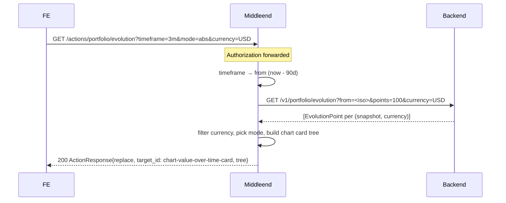

# Portfolio — Layer 4a: Value Over Time chart

First half of layer 4. Adds a Value Over Time chart card at the bottom of the portfolio screen with three controls (timeframe, mode `$/%`, currency). Introduces the `line_chart` custom component — see [`sdui-custom-components.md §1`](../../sdui-custom-components.md#1-line_chart).

Layer 4b (Asset Value Over Time, multi-series) reuses the same `line_chart` component and lands in a separate spec.

## Endpoint (new)

| Method | Path                                 | Auth | Description                                                                   |
|--------|--------------------------------------|------|-------------------------------------------------------------------------------|
| GET    | `/actions/portfolio/evolution`       | yes  | Reload action; returns `ActionResponse{replace}` of the chart card.            |

### Query params

| Param       | Type                                   | Default                           | Invalid → |
|-------------|----------------------------------------|-----------------------------------|-----------|
| `timeframe` | enum `1m / 3m / 6m / ytd / 1y / all`   | `all`                             | 400 `BAD_REQUEST` |
| `mode`      | enum `abs / pct`                       | `abs`                             | 400 |
| `currency`  | ISO code (`USD`, `EUR`, ...)           | first currency available in data  | 400 if empty string, otherwise passed through (if unknown → empty dataset → empty state) |

`timeframe` → `from` mapping on the backend call:

| `timeframe` | `from` value                                  |
|-------------|-----------------------------------------------|
| `1m`        | `now - 30 days`                               |
| `3m`        | `now - 90 days`                               |
| `6m`        | `now - 180 days`                              |
| `ytd`       | `start-of-year` at UTC (`YYYY-01-01T00:00:00Z`)|
| `1y`        | `now - 365 days`                              |
| `all`       | omit `from` param                             |

`points` sent to the backend: always `100` (the backend downsamples).

## Flow



## Tree of the chart card

```
card chart-value-over-time-card
  column chart-value-over-time-content (gap md)
    row controls-row (gap lg)
      row timeframe-controls (gap sm)
        button chart-timeframe-1m
          props: { label: i18n("portfolio.chart.timeframe.1m"), variant, style }
          actions: [{ trigger: click, type: reload,
                      endpoint: /actions/portfolio/evolution?timeframe=1m&mode=<cur>&currency=<cur>,
                      target_id: chart-value-over-time-card }]
        button chart-timeframe-3m
        button chart-timeframe-6m
        button chart-timeframe-ytd
        button chart-timeframe-1y
        button chart-timeframe-all
      row mode-controls (gap sm)
        button chart-mode-abs
          props: { label: i18n("portfolio.chart.mode.abs") = "$", variant, style }
          actions: [{ trigger: click, type: reload,
                      endpoint: /actions/portfolio/evolution?timeframe=<cur>&mode=abs&currency=<cur>,
                      target_id: chart-value-over-time-card }]
        button chart-mode-pct
      row currency-controls (gap sm)    (only when n_currencies > 1)
        button chart-currency-USD
        button chart-currency-EUR
        ...
    line_chart chart-value-over-time
      props: (see §line_chart payload)
```

### Selected-state encoding on controls

All three control groups follow the same rule:

- Selected option: `variant: "primary"`, `style: "solid"`.
- Non-selected options: `variant: "secondary"`, `style: "ghost"`.

Both combinations are within the existing button enum in `sdui-base-components.md`. No new props.

### URL encoding per button

Each button's `endpoint` contains the **full new state** that clicking it produces — the changed field plus the current values of the other two. The middleend stamps every button's URL on every tree build. Example for current state `timeframe=3m, mode=abs, currency=USD`:

- Button `chart-timeframe-1m` → `...?timeframe=1m&mode=abs&currency=USD`
- Button `chart-mode-pct`     → `...?timeframe=3m&mode=pct&currency=USD`
- Button `chart-currency-EUR` → `...?timeframe=3m&mode=abs&currency=EUR`

No client-side state is required. The frontend is a pure renderer.

## `line_chart` payload

See `sdui-custom-components.md §1` for the full contract. Values emitted for this card:

| Prop | Value |
|---|---|
| `id` | `chart-value-over-time` |
| `height` | `md` |
| `series` | Single entry: `{ key: "value", label: i18n("portfolio.chart.series.value"), color: "chart_1", value_format: <depends on mode> }` |
| `x_axis` | `{ key: "date", format: "month_year" }` |
| `y_axis` | `{ format: <depends on mode> }` |
| `data` | One row per evolution point: `{ date: <RFC3339 date string>, value: <number> }` |
| `empty_message` | i18n (see below) |

`value_format` / `y_axis.format` by mode:

| Mode    | Format            |
|---------|-------------------|
| `abs`   | `currency_compact`|
| `pct`   | `percent_signed`  |

### `data` computation per point

- `abs`: `value = point.total_value` (number).
- `pct`: `value = (point.total_value - point.total_cost) / point.total_cost × 100`.

`pct` requires `total_cost` on evolution points. If the backend does not return `total_cost` for a given response, the middleend emits `data: []` and `empty_message: i18n("portfolio.chart.no_cost_data")`. This is a bounded-size failure mode — the user can still switch back to `abs`.

### `data` filtering

The backend returns one `EvolutionPoint` per `(snapshot, currency)`. The middleend filters to only the points matching the selected `currency` before building `data`. Currency ordering for the currency selector uses the same descending total-value rule as the summary row (layer 2), computed from the most recent snapshot per currency.

### `empty_message` choice

| Condition | i18n key |
|---|---|
| `<2` points after filtering | `portfolio.chart.not_enough_data` |
| `pct` requested but no `total_cost` on any returned point | `portfolio.chart.no_cost_data` |

## Integration with `GET /screens/portfolio`

The chart card is inserted at the end of `portfolio-root`:

```
column portfolio-root
  portfolio-summary-row
  include-closed-form
  positions-table-card
  chart-value-over-time-card   ← new
```

Initial state emitted on the first `GET /screens/portfolio`:

- `timeframe: "all"`
- `mode: "abs"`
- `currency: <first currency by descending total value; omitted from URL if no currencies>`

If there are no positions (empty portfolio), the chart card is **not** emitted — same rule as the summary row.

## Error handling

| Situation                                       | HTTP | Body                                                         |
|-------------------------------------------------|------|--------------------------------------------------------------|
| Missing / invalid / expired JWT                 | 401  | `{"error":"unauthorized","redirect":"/screens/login"}`       |
| Invalid query param (enum or unparseable)       | 400  | `{"error":{"code":"BAD_REQUEST","message":"..."}}`           |
| Backend 401                                     | 401  | `{"error":"unauthorized","redirect":"/screens/login"}`       |
| Backend 5xx / network / malformed JSON          | 502  | `{"error":{"code":"BACKEND_ERROR","message":"..."}}`         |

## i18n keys introduced

| Key                                          | en                        | es                          |
|----------------------------------------------|---------------------------|-----------------------------|
| `portfolio.chart.value_over_time.title`      | Portfolio Value Over Time | Valor del portafolio        |
| `portfolio.chart.series.value`               | Value                     | Valor                       |
| `portfolio.chart.timeframe.1m`               | 1M                        | 1M                          |
| `portfolio.chart.timeframe.3m`               | 3M                        | 3M                          |
| `portfolio.chart.timeframe.6m`               | 6M                        | 6M                          |
| `portfolio.chart.timeframe.ytd`              | YTD                       | AÑO                         |
| `portfolio.chart.timeframe.1y`               | 1Y                        | 1A                          |
| `portfolio.chart.timeframe.all`              | All                       | Todo                        |
| `portfolio.chart.mode.abs`                   | $                         | $                           |
| `portfolio.chart.mode.pct`                   | %                         | %                           |
| `portfolio.chart.not_enough_data`            | Record at least two snapshots to see the chart. | Registrá al menos dos snapshots para ver el gráfico. |
| `portfolio.chart.no_cost_data`               | No cost data available.   | Sin datos de costo.         |

## Package layout (incremental on layer 3)

```
internal/components/
  charts.go                      + LineChart helper; types: Series, ValueFormat, AxisFormat, ChartColorToken
  charts_test.go                 +

internal/portfolio/
  client.go                      ~ add GetEvolution(q EvolutionQuery) (keeps GetEvolutionLast from layer 2)
  client_test.go                 ~ add tests for GetEvolution
  chart_builder.go               + BuildValueOverTimeCard(points, state ChartState, currencies []string, lang) components.Component
  chart_builder_test.go          +
  evolution_handler.go           + GET handler for /actions/portfolio/evolution
  evolution_handler_test.go      +
  builder.go                     ~ BuildScreen appends chart card when positions non-empty
  builder_test.go                ~ assert chart card present; absent when empty

internal/server/server.go        ~ register protected GET /actions/portfolio/evolution

locales/{en,es}.json             ~ portfolio.chart.* keys

spec/sdui-custom-components.md   (referenced; see §1.line_chart)
```

## Scope explicitly out

- **Asset Value Over Time** (multi-series chart) — layer 4b.
- **Legend with interactive toggles** — not needed for single-series; lands with layer 4b.
- **Allocation donut** — not part of layer 4 per the portfolio decomposition.
- **Mobile responsive** — controls wrap / chart resizes — layer 6.
- **Polling / live updates on the chart** — out of scope; covered separately if needed.

## Acceptance criteria

- [ ] `GET /screens/portfolio` with non-empty positions emits `card#chart-value-over-time-card` at the end of `portfolio-root`.
- [ ] With empty positions, the chart card is not emitted (the empty block from layer 1 is shown instead).
- [ ] The chart card contains three control groups (`timeframe-controls`, `mode-controls`, and `currency-controls` only when there are >1 currencies), and a `line_chart#chart-value-over-time`.
- [ ] Each control button's action is `{trigger: click, type: reload, endpoint: /actions/portfolio/evolution?<state>, target_id: chart-value-over-time-card}` where `<state>` carries the full new state.
- [ ] Selected button uses `variant: primary, style: solid`; others `variant: secondary, style: ghost`.
- [ ] Initial render: `timeframe=all, mode=abs, currency=<first by total value desc>`.
- [ ] `GET /actions/portfolio/evolution?timeframe=3m&mode=abs&currency=USD` returns `ActionResponse{action: replace, target_id: chart-value-over-time-card, tree: <card>}`.
- [ ] `timeframe` is translated to `from` on the backend call per the table above; `all` omits `from`; `points=100`; `currency` passed through.
- [ ] `mode=abs`: `data` rows emit `{date, value: point.total_value}`. `y_axis.format` and series `value_format` are `currency_compact`.
- [ ] `mode=pct` with `total_cost` present: `data` emits `{date, value: (total_value - total_cost) / total_cost × 100}`. Formats are `percent_signed`.
- [ ] `mode=pct` with no `total_cost` in any returned point: `data: []`, `empty_message: i18n("portfolio.chart.no_cost_data")`.
- [ ] Data with fewer than 2 points after filtering: `empty_message: i18n("portfolio.chart.not_enough_data")`.
- [ ] Invalid query param → 400; BE 401 → 401 redirect; BE 5xx → 502.
- [ ] `Authorization` forwarded to the backend on every call.
