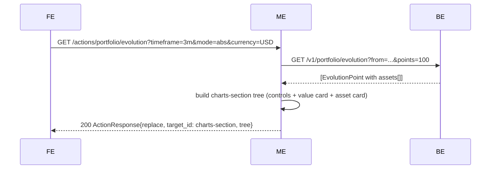

# Portfolio — Layer 4b: Asset Value Over Time

Second half of layer 4. Adds a second chart card — Asset Value Over Time — that shares the same controls as the Value Over Time chart. Both cards live inside a new `charts-section` wrapper that is the target of the reload action. Introduces per-asset data parsing from the backend's evolution response.

This layer changes the structure established in [`04a-value-over-time.md`](04a-value-over-time.md): the controls move out of the first card and become siblings above both cards. The reload target changes from `chart-value-over-time-card` to `charts-section`.

## Endpoint (unchanged path and query params)

| Method | Path                            | Auth | Description                                                 |
|--------|---------------------------------|------|-------------------------------------------------------------|
| GET    | `/actions/portfolio/evolution`  | yes  | Reload; returns `ActionResponse{replace}` of `charts-section`. |

Query params, validation, and `timeframe → from` mapping are identical to layer 4a. The only change is the response shape: now the tree contains both chart cards plus the controls.

## Flow



## New structural wrapper: `charts-section`

`charts-section` is a `column` (no card). It is a direct child of `portfolio-root` and replaces the previous single `chart-value-over-time-card`. It wraps the controls row and both chart cards, so a single `replace` action swaps everything at once.

```
column portfolio-root (gap lg)
  summary-row
  include-closed-form
  positions-table-card
  column charts-section (gap lg)                   ← reload target
    row controls-row (gap lg)
      (currency-controls? | spacer | mode-controls | timeframe-controls)
    card chart-value-over-time-card
      column chart-value-over-time-content (gap md)
        text chart-value-over-time-title          → i18n "portfolio.chart.value_over_time.title"
        line_chart chart-value-over-time
    card chart-asset-value-over-time-card
      column chart-asset-value-over-time-content (gap md)
        text chart-asset-value-over-time-title    → i18n "portfolio.chart.asset_value_over_time.title"
        line_chart chart-asset-value-over-time
```

### Changes vs. layer 4a

- Controls row moves from **inside** `chart-value-over-time-card` to **above** both cards.
- `chart-value-over-time-card`'s inner content simplifies: a title `text` + the `line_chart`.
- Every control button's reload `target_id` changes from `chart-value-over-time-card` to `charts-section`.

## Backend response extension

Each `EvolutionPoint` in the backend response carries an `assets` array alongside `total_value`:

```json
{
  "snapshot_id": "...",
  "recorded_at": "2026-04-10T10:00:00Z",
  "is_full_snapshot": true,
  "total_value": "15420.50",
  "total_cost": "12000.00",
  "currency": "USD",
  "assets": [
    { "asset_id": "uuid-1", "ticker": "AAPL", "value": "5000.00" },
    { "asset_id": "uuid-2", "ticker": "GOOG", "value": "10420.50" }
  ]
}
```

Middleend parses the `assets` field (added to `EvolutionPoint`) as `[]AssetValue{AssetID, Ticker, Value}` where `Value` is a float. Missing `value` or parse errors render that asset as absent from the point (rather than zero).

## Value chart (unchanged behavior, trimmed tree)

`line_chart#chart-value-over-time` still emits:
- Single series `{ key: "value", label: i18n("portfolio.chart.series.value"), color: "chart_1", value_format: <mode-dependent> }`.
- Same data shape: `[{ date, value }]`.
- Same `empty_message` handling.
- Same `mode` behavior: `abs` → `currency_compact`, `pct` → `percent_signed` computed from `total_cost`.

Only difference: the card now contains a title `text` above the chart (new), and no controls inside (moved out).

## Asset chart

`line_chart#chart-asset-value-over-time` — multi-series line chart, always in absolute currency regardless of `mode`.

### Series

One entry per ticker that appears in the filtered data. Determined this way:

1. Filter evolution points by `state.Currency`.
2. Collect every distinct `(asset_id, ticker)` across the filtered points.
3. Order tickers by the value in the **most recent** point they appear in, descending. Ties broken by ticker ascending.
4. Emit one `Series` per ticker:
   - `key`: the ticker string (e.g. `"AAPL"`).
   - `label`: ticker string (same — we do not localize tickers).
   - `color`: `chart_1..chart_5` cycling by series index (index 5 → `chart_1` again).
   - `value_format`: always `currency_compact`.

### Data rows

One row per filtered evolution point, sorted by `recorded_at` ascending. Each row carries `date` plus one key per ticker with either the asset's value or `null` if the ticker is absent in that snapshot:

```json
{ "date": "2026-01-15", "AAPL": 1000.0, "GOOG": 2000.0, "TSLA": null }
```

Nulls represent real gaps (ticker did not exist in that snapshot). The frontend renders gaps using `connectNulls: false`.

### `mode` does not affect the asset chart

The asset chart always emits absolute values with `currency_compact` formatting. When the user toggles `%`, only the value chart's series change; the asset chart re-renders with the same shape.

### Legend

Convention: if `series.length > 1`, the frontend renders an interactive legend with per-line visibility toggles (client-side only). Single-series charts hide the legend. No new prop on `line_chart`; the frontend decides based on series count.

### Empty state

- If `data` has fewer than 2 rows after filtering → `empty_message: i18n("portfolio.chart.not_enough_data")`, data becomes empty.
- If there are 2+ evolution points but no tickers ever appear in assets (complex-asset-only snapshots) → `data: []`, `empty_message` uses the same key.

## Initial screen render

`GET /screens/portfolio` emits `charts-section` at the position previously occupied by `chart-value-over-time-card`. The initial state is unchanged: `timeframe: all`, `mode: abs`, `currency: <first by total value>`.

When `positions` is empty, `charts-section` is **not** emitted (same rule as before).

## i18n keys introduced

| Key                                               | en                         | es                                |
|---------------------------------------------------|----------------------------|-----------------------------------|
| `portfolio.chart.value_over_time.title`           | Portfolio Value Over Time  | Valor del portafolio en el tiempo |
| `portfolio.chart.asset_value_over_time.title`     | Asset Value Over Time      | Valor por activo en el tiempo     |

`portfolio.chart.value_over_time.title` already exists from layer 4a and gets rendered as a `text` inside the card. The asset chart title is new.

## Package layout (incremental on layer 4a)

| File | Change |
|---|---|
| `internal/portfolio/evolution.go` | Add `AssetValue{AssetID, Ticker, Value float64}` type and `Assets []AssetValue` on `EvolutionPoint`. Parse `assets` in `ParseEvolution`. |
| `internal/portfolio/evolution_test.go` | Tests for the `assets` parsing (with and without, null values, etc). |
| `internal/portfolio/chart_builder.go` | Add `BuildAssetValueOverTimeCard(points, state, lang)` — builds only the asset chart card. Add `BuildChartsSection(points, state, currencies, lang)` — the wrapper column with controls + both cards. Simplify `BuildValueOverTimeCard` to contain only the title + line_chart (no controls); the controls go at the `charts-section` level. |
| `internal/portfolio/chart_builder_test.go` | Update existing tests; add asset-card and charts-section tests. |
| `internal/portfolio/evolution_handler.go` | Return `charts-section` tree (via `BuildChartsSection`) instead of just the value card. Target id becomes `charts-section`. |
| `internal/portfolio/evolution_handler_test.go` | Update existing tests; add asset-chart smoke tests. |
| `internal/portfolio/builder.go` | Rename / replace `buildInitialChartCard` with `buildInitialChartsSection`; root column includes this section instead of the old card. |
| `internal/portfolio/builder_test.go` | Rename existing chart-related tests; add assertions that both cards appear. |
| `locales/{en,es}.json` | Add `portfolio.chart.asset_value_over_time.title`. (`value_over_time.title` already exists.) |

## Scope explicitly out

- **`mode=pct` on asset chart** — intentionally not supported. Asset chart is always absolute.
- **Allocation donut** — different decomposition layer.
- **Per-asset pagination** — if a user has 50+ tickers, the chart gets noisy. Not handled in this layer; the frontend's interactive legend mitigates visually. A future polish layer may introduce a max-N cap with a "+N more" indicator.
- **Responsive / mobile layout** — layer 6.

## Acceptance criteria

- [ ] `GET /screens/portfolio` with non-empty positions emits `column#charts-section` at the end of `portfolio-root`. The old single-card placement is gone.
- [ ] `charts-section` has three direct children in this order: `row#controls-row`, `card#chart-value-over-time-card`, `card#chart-asset-value-over-time-card`.
- [ ] Each chart card contains a `text` title (localized) and a `line_chart` component, in that order.
- [ ] Every control button's `reload` action has `target_id: "charts-section"`.
- [ ] `GET /actions/portfolio/evolution?...` returns `ActionResponse{action: replace, target_id: "charts-section", tree}` where `tree.type == "column"` and `tree.id == "charts-section"`.
- [ ] `chart-asset-value-over-time` is a `line_chart` whose `series` has one entry per distinct ticker present in the filtered data, colors cycling through `chart_1..chart_5`, all with `value_format: "currency_compact"`.
- [ ] Asset chart series are ordered by their most-recent value descending, with ticker ascending as tiebreaker.
- [ ] Asset chart `data` rows carry `date` plus one key per ticker (null when absent in that snapshot).
- [ ] `mode=pct` only affects the value chart. The asset chart's series `value_format` and `y_axis.format` remain `currency_compact`.
- [ ] `Assets` is parsed from the backend evolution response on `EvolutionPoint`.
- [ ] Data with fewer than 2 evolution points after currency filtering → asset chart emits `empty_message: i18n("portfolio.chart.not_enough_data")` and `data: []`.
- [ ] Empty portfolio (`len(positions) == 0`) does not emit `charts-section` at all (empty state from layer 1 is used).
- [ ] Invalid query param → 400; BE 401 → 401 redirect; BE 5xx → 502 (unchanged from 4a).
