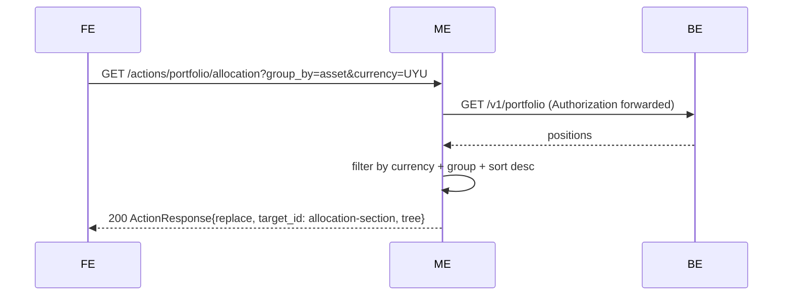

# Portfolio — Layer 4c: Allocation (pie chart)

Third chart capability for the portfolio screen. Adds a standalone **allocation section** at the end of `portfolio-root` with its own controls (group by asset/type + currency). Uses the `pie_chart` custom component defined in [`sdui-custom-components.md §2`](../../sdui-custom-components.md#2-pie_chart).

The allocation is a **snapshot of the current portfolio state**, derived from `/v1/portfolio` (positions). It does not use historical data and does not share controls with `charts-section` — timeframe and `$/%` mode do not apply.

## Endpoint (new)

| Method | Path                             | Auth | Description                                                              |
|--------|----------------------------------|------|--------------------------------------------------------------------------|
| GET    | `/actions/portfolio/allocation`  | yes  | Reload; returns `ActionResponse{replace}` of the `allocation-section`.   |

### Query params

| Param      | Type                | Default                                  | Invalid → |
|------------|---------------------|------------------------------------------|-----------|
| `group_by` | enum `asset / type` | `asset`                                  | 400 `BAD_REQUEST` |
| `currency` | ISO code            | first currency by total value DESC       | passed through (unknown → empty dataset → empty state) |

## Flow



## Tree

```
column allocation-section (gap lg)              ← reload target
  row allocation-controls-row (gap lg)
    (currency-controls? | spacer | allocation-group-by-controls)
  card chart-allocation-card
    column chart-allocation-content (gap md)
      text chart-allocation-title           → i18n "portfolio.allocation.title"
      pie_chart chart-allocation
```

### Controls layout

Mirrors the `charts-section` pattern: currency on the left (when multi-currency), group_by on the right, with a `1fr` spacer between them.

- Multi-currency: `widths = ["auto", "1fr", "auto"]` → `[currency-controls, spacer, allocation-group-by-controls]`.
- Single currency: `widths = ["1fr", "auto"]` → `[spacer, allocation-group-by-controls]`.

### `allocation-group-by-controls`

Two buttons, mutually exclusive:

```
row allocation-group-by-controls (gap sm)
  button allocation-group-by-asset   label = i18n "portfolio.allocation.group_by.asset"
  button allocation-group-by-type    label = i18n "portfolio.allocation.group_by.type"
```

Selected button: `variant: primary, style: solid`. Other: `variant: secondary, style: ghost`. All buttons emit `size: "sm"` consistent with chart controls.

### URL encoding per button

Each button's `endpoint` carries the full new state produced by clicking it. Example for current state `group_by=asset, currency=UYU`:

- `allocation-group-by-asset`  → `/actions/portfolio/allocation?group_by=asset&currency=UYU`
- `allocation-group-by-type`   → `/actions/portfolio/allocation?group_by=type&currency=UYU`
- `chart-currency-USD`         → `/actions/portfolio/allocation?group_by=asset&currency=USD`

Each button's action: `{ trigger: click, type: reload, endpoint, target_id: allocation-section }`.

## `pie_chart` payload

Per `sdui-custom-components.md §2`:

| Prop | Value |
|---|---|
| `id` | `chart-allocation` |
| `height` | `md` |
| `shape` | `donut` |
| `value_format` | `currency_compact` |
| `show_legend` | `true` |
| `slices` | computed (see below) |
| `empty_message` | i18n `portfolio.allocation.empty` |

## Slice computation

Start from the full `positions` array (the layer 1 `GetPositions(ctx, auth, false)` shape — open positions only for this layer).

1. **Filter**: keep only positions with `Currency == state.Currency` and `CurrentValue != nil`.
2. **Group**:
   - `group_by: asset` — one slice per unique `(asset_id)`. Typically one position per asset, but sum `current_value` across duplicates defensively. `key = asset_id`, `label = ticker`.
   - `group_by: type` — one slice per unique `asset_type` (e.g. `"STOCK"`, `"BOND"`, `"COMPLEX"`). `key = asset_type`, `label = asset_type` (raw backend string; i18n translation of asset types is deferred to a polish layer).
3. **Sort**: `value` DESC, tiebreaker `label` ASC.
4. **Colors**: `chart_1`, `chart_2`, ..., cycling through `chart_5` beyond five slices.

If the filter leaves no positions with `CurrentValue != nil`, emit `slices: []` and the localized `empty_message`.

## Integration with `GET /screens/portfolio`

Appended at the end of `portfolio-root`, after `charts-section`:

```
column portfolio-root
  portfolio-summary-row
  include-closed-form
  positions-table-card
  charts-section
  allocation-section           ← new
```

Initial state on the first screen fetch: `group_by=asset`, `currency=<first by total value DESC>`. Reuses the `positions` already fetched by the use case — no extra BE call on initial render.

When `positions` is empty, `allocation-section` is not emitted (same rule as the other sections).

## Error handling

| Situation | HTTP | Body |
|---|---|---|
| Invalid query param | 400 | `{"error":{"code":"BAD_REQUEST","message":"..."}}` |
| Missing / invalid / expired JWT | 401 | `{"error":"unauthorized","redirect":"/screens/login"}` |
| Backend 401 on downstream call | 401 | same |
| Backend 5xx / network / malformed | 502 | `{"error":{"code":"BACKEND_ERROR","message":"..."}}` |

## i18n keys introduced

| Key                                    | en                              | es                              |
|----------------------------------------|---------------------------------|---------------------------------|
| `portfolio.allocation.title`           | Allocation                      | Distribución                    |
| `portfolio.allocation.group_by.asset`  | By asset                        | Por activo                      |
| `portfolio.allocation.group_by.type`   | By type                         | Por tipo                        |
| `portfolio.allocation.empty`           | No positions with known value   | Sin posiciones con valor conocido |

## Package layout (incremental on layer 4b)

| File | Change |
|---|---|
| `internal/portfolio/allocation_builder.go` | **new** — `AllocationState{GroupBy, Currency}` + `BuildAllocationSection(positions, state, currencies, lang) components.Component`. Pure, no BE. |
| `internal/portfolio/allocation_builder_test.go` | **new** — controls order, selected state, URL encoding, slice computation per group_by, empty state. |
| `internal/portfolio/allocation_handler.go` | **new** — `GET /actions/portfolio/allocation`. Reads query params, fetches positions, builds `allocation-section`. |
| `internal/portfolio/allocation_handler_test.go` | **new** — success, invalid params, BE 401, BE 5xx. |
| `internal/portfolio/builder.go` | **modify** — `BuildScreen` appends `allocation-section` after `charts-section` when positions non-empty. `buildInitialAllocationSection` helper chooses default state from positions. |
| `internal/portfolio/builder_test.go` | **modify** — assert `allocation-section` present with positions, absent with empty. |
| `internal/server/server.go` | **modify** — register protected `GET /actions/portfolio/allocation`. |
| `locales/{en,es}.json` | **modify** — add the four keys above. |

## Scope explicitly out

- i18n translation of `asset_type` values (`STOCK` → "Acción" / "Stock"). Deferred to a polish layer. Layer 4c emits the raw BE string in `label` for `group_by=type` slices.
- "Other" bucket / max slice cap. The handler does not truncate. If user has 50 positions, the chart gets 50 slices.
- Drill-down on slice click. No `Slice.action` emitted.
- Responsive mobile layout. Layer 6.

## Acceptance criteria

- [ ] `GET /screens/portfolio` with non-empty positions emits `column#allocation-section` at the end of `portfolio-root`, after `charts-section`.
- [ ] Empty positions → `allocation-section` not emitted.
- [ ] `allocation-section` contains exactly two children in order: `row#allocation-controls-row`, `card#chart-allocation-card`.
- [ ] `chart-allocation-card` contains a title `text` (localized) and a `pie_chart#chart-allocation`, in that order.
- [ ] `allocation-group-by-controls` has exactly two buttons in order: `allocation-group-by-asset`, `allocation-group-by-type`.
- [ ] Selected button styled `primary/solid`; others `secondary/ghost`.
- [ ] Each control button's action is `{trigger: click, type: reload, endpoint: /actions/portfolio/allocation?<state>, target_id: allocation-section}`.
- [ ] Initial state: `group_by=asset`, `currency=<first by total value DESC>`.
- [ ] `GET /actions/portfolio/allocation?group_by=asset&currency=UYU` returns `ActionResponse{action: replace, target_id: allocation-section, tree: <column#allocation-section>}`.
- [ ] `group_by=asset` produces one slice per `asset_id` (`key: asset_id`, `label: ticker`), value = sum of `current_value` over positions in that asset and currency.
- [ ] `group_by=type` produces one slice per `asset_type` (`key: asset_type`, `label: asset_type`), value = sum of `current_value` over positions in that type and currency.
- [ ] Slices are sorted by `value` DESC; ties broken by `label` ASC.
- [ ] Colors cycle through `chart_1..chart_5` by slice index.
- [ ] `pie_chart` payload: `shape: donut`, `value_format: currency_compact`, `show_legend: true`.
- [ ] No positions with `current_value != nil` for the selected currency → `slices: []` + `empty_message: i18n("portfolio.allocation.empty")`.
- [ ] Invalid `group_by` value → 400; BE 401 → 401 + redirect; BE 5xx → 502.
- [ ] Currency controls rendered only when `n_currencies > 1`.
- [ ] `Authorization` is forwarded to the backend on the downstream call.
