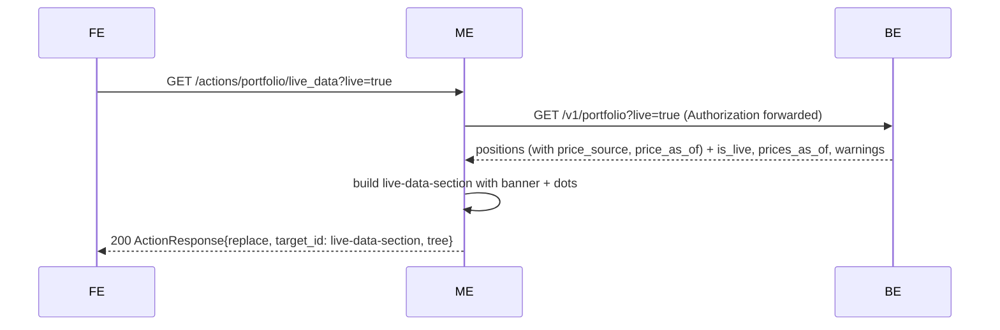
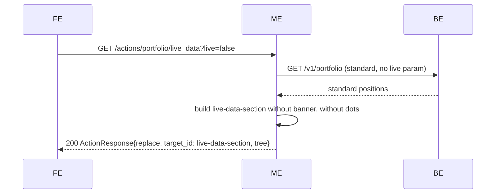
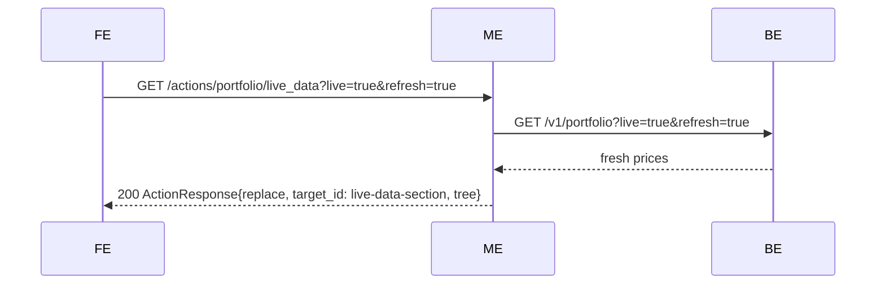

# Portfolio — Layer 5: Live mode

Adds real-time price support to the portfolio screen. A single "Live" button toggles live mode; when active, the backend fetches current prices from external providers and the middleend renders a banner with timestamp + refresh control, plus per-position price-source indicators. Charts and allocation are unaffected — they use historical evolution data, not the portfolio endpoint.

## Structural change: `live-data-section`

The upper part of `portfolio-root` (summary, include-closed form, positions table) is wrapped in a new `column#live-data-section` that serves as the reload target for live toggle and refresh actions. Charts and allocation remain direct children of `portfolio-root`, outside the section.

```
column portfolio-root (gap lg)
  column live-data-section (gap lg)              ← reload target
    row live-header-row widths=["auto","1fr","auto"]
      text portfolio-title                       → i18n "portfolio.title", size=lg, weight=bold
      column live-header-spacer
      button live-toggle                         → reload (toggles live on/off)
    row live-banner (conditional — only when is_live=true)
      text live-status                           → "● Live prices · Updated {relativeTime}"
      column live-banner-spacer
      button live-refresh                        → reload ?live=true&refresh=true
    text live-warnings (conditional — only when warnings non-empty)
      → "⚠ Could not fetch: DOGE, SHIB", color=muted
    summary-row
    include-closed-form
    positions-table-card
  charts-section
  allocation-section
```

### What changes vs. layer 4

- `summary-row`, `include-closed-form`, and `positions-table-card` move from being direct children of `portfolio-root` to being children of `live-data-section`.
- A new `live-header-row` with the portfolio title and the live toggle button is inserted at the top of `live-data-section`.
- `charts-section` and `allocation-section` remain direct children of `portfolio-root` and are never replaced by live mode actions.
- The include-closed form's submit action continues to target `positions-table-card` (nested inside `live-data-section`). This works because `positions-table-card` is still a descendant of the screen — the FE finds it by ID.

## Endpoint (new)

| Method | Path                                  | Auth | Description                                                          |
|--------|---------------------------------------|------|----------------------------------------------------------------------|
| GET    | `/actions/portfolio/live_data`        | yes  | Reload; returns `ActionResponse{replace}` of `live-data-section`.    |

### Query params

| Param     | Type          | Default | Description                                                        |
|-----------|---------------|---------|--------------------------------------------------------------------|
| `live`    | `true/false`  | `false` | When `true`, the middleend calls the BE with `?live=true`.         |
| `refresh` | `true`        | omitted | Only valid with `live=true`. Forces the BE to re-fetch live prices (cache bust). |

Invalid combinations (`refresh=true` without `live=true`) are silently treated as `live=false` — no error.

## Flow

### Toggle on



### Toggle off



### Refresh



## Backend response extension (when `live=true`)

The BE extends its response with top-level metadata:

```json
{
  "positions": [...],
  "is_live": true,
  "prices_as_of": "2026-04-14T12:00:00Z",
  "warnings": [
    { "asset_id": "uuid", "ticker": "DOGE", "error": "provider timeout" }
  ]
}
```

Each position gains optional live fields:

```json
{
  "price_source": "live",
  "price_as_of": "2026-04-14T12:00:00Z"
}
```

`price_source` values: `"live"` | `"snapshot"` | `"none"`.

When `live=false`, none of these fields are present.

## Live toggle button

A single `button` inside `live-header-row`. Its reload URL carries the **opposite** state:

| Current state | Button appearance | Reload URL |
|---|---|---|
| Standard (live=false) | `variant: secondary, style: ghost, size: sm`, label: i18n("portfolio.live.toggle") | `?live=true` |
| Live (live=true) | `variant: primary, style: solid, size: sm`, label: i18n("portfolio.live.toggle") | `?live=false` |

Action: `{ trigger: click, type: reload, endpoint: <url>, target_id: live-data-section }`.

## Live banner

Only emitted when `is_live == true`.

```
row live-banner widths=["auto","1fr","auto"]
  text live-status
    content: i18n "portfolio.live.status" interpolated with relative time from prices_as_of
    color: primary
  column live-banner-spacer
  button live-refresh
    label: i18n "portfolio.live.refresh"
    variant: secondary, style: outline, size: sm
    action: { trigger: click, type: reload,
              endpoint: /actions/portfolio/live_data?live=true&refresh=true,
              target_id: live-data-section }
```

## Live warnings

Only emitted when `warnings` array is non-empty. Sits below the banner.

```
text live-warnings
  content: i18n("portfolio.live.warning_prefix") + " " + comma-joined tickers from warnings
  color: muted
  size: sm
```

## Price source dots in positions table

When `is_live == true`, each position row gains an extra `text` component at the start of the Market Value cell (or as a separate cell — implementation detail). The dot indicates where the price came from:

| `price_source` | Content | Color |
|---|---|---|
| `"live"` | `"●"` | `positive` |
| `"snapshot"` | `"●"` | `muted` |
| `"none"` | `"●"` | `negative` |

When `is_live == false` (standard mode), no dots are emitted. The 11-column structure stays the same — the dot is prepended inside the Market Value cell as a visual indicator, not an extra column.

## Parsing changes

### `Position` (in `types.go`)

Add optional fields:

```go
PriceSource *string    // "live", "snapshot", "none"; nil in standard mode
PriceAsOf   *time.Time // nil in standard mode
```

Parse from `price_source` and `price_as_of` in the BE response.

### Portfolio response wrapper

New struct or fields to capture the top-level live metadata:

```go
type PortfolioResponse struct {
    Positions  []Position
    IsLive     bool
    PricesAsOf *time.Time
    Warnings   []LiveWarning
}

type LiveWarning struct {
    AssetID string
    Ticker  string
    Error   string
}
```

`Client.GetPositions` returns `PortfolioResponse` instead of `[]Position` (breaking change — all callers updated).

## Client changes

`GetPositions` signature evolves to support live params:

```go
func (c *Client) GetPositions(ctx, auth string, includeClosed, live, refresh bool) (*PortfolioResponse, error)
```

The method appends `?live=true` and/or `?refresh=true` as query params when the corresponding bools are true. `include_closed` keeps working as before.

All existing callers (use case, include_closed handler, allocation handler) pass `live: false, refresh: false`.

## State: not persisted

Every `GET /screens/portfolio` starts in standard mode (live=false). The live toggle state exists only in the tree's button URLs. If the user reloads the page, they return to standard. Legacy matches this behavior.

## Error handling

| Situation | HTTP | Body |
|---|---|---|
| BE 401 | 401 | `{"error":"unauthorized","redirect":"/screens/login"}` |
| BE 5xx / network | 502 | `{"error":{"code":"BACKEND_ERROR","message":"..."}}` |

No 400 validation needed (live and refresh are booleans with defaults).

## i18n keys introduced

| Key | en | es |
|---|---|---|
| `portfolio.live.toggle` | Live | En vivo |
| `portfolio.live.status` | ● Live prices · Updated {time} | ● Precios en vivo · Actualizado {time} |
| `portfolio.live.refresh` | Refresh | Actualizar |
| `portfolio.live.warning_prefix` | ⚠ Could not fetch: | ⚠ No se pudo obtener: |

## Package layout (incremental on layer 4c)

| File | Change |
|---|---|
| `internal/portfolio/types.go` | Add `PriceSource *string`, `PriceAsOf *time.Time` to `Position`. Add `PortfolioResponse`, `LiveWarning`. Update `ParsePositions` to return `*PortfolioResponse`. |
| `internal/portfolio/types_test.go` | Tests for new fields + response wrapper parsing. |
| `internal/portfolio/client.go` | `GetPositions` returns `*PortfolioResponse`; gains `live`, `refresh` bool params; appends query params. |
| `internal/portfolio/client_test.go` | Update all existing tests + new tests for live/refresh params. |
| `internal/portfolio/get_usecase.go` | Update to use `PortfolioResponse`. Extract `positions` for sorting + chart. Pass `IsLive`, `PricesAsOf`, `Warnings` to builder. |
| `internal/portfolio/get_usecase_test.go` | Update `fakeFetcher`. |
| `internal/portfolio/handler_test.go` | Update `stubFetcher`. |
| `internal/portfolio/include_closed_handler.go` | Update to use `PortfolioResponse` (pass `live: false, refresh: false`). |
| `internal/portfolio/include_closed_handler_test.go` | Update stub. |
| `internal/portfolio/allocation_handler.go` | Same update. |
| `internal/portfolio/allocation_handler_test.go` | Update stub. |
| `internal/portfolio/live_builder.go` | **new** — `BuildLiveDataSection(resp *PortfolioResponse, evolution []EvolutionPoint, metrics SummaryMetrics, liveState LiveState, currencies []string, lang string, now time.Time)`. Assembles header + optional banner + optional warnings + summary + include-closed + table with optional dots. |
| `internal/portfolio/live_builder_test.go` | **new** — full coverage: standard mode (no banner/dots), live mode (banner + dots + warnings), refresh button URL, toggle URL encoding. |
| `internal/portfolio/live_handler.go` | **new** — `GET /actions/portfolio/live_data` handler. |
| `internal/portfolio/live_handler_test.go` | **new** — success (live on/off), refresh param, BE 401, BE 502. |
| `internal/portfolio/builder.go` | `BuildScreen` wraps data in `live-data-section` via the live builder; `portfolio-root` now has `[live-data-section, charts-section, allocation-section]`. |
| `internal/portfolio/builder_test.go` | Update: `live-data-section` present, contains summary + table; charts/allocation outside. |
| `internal/server/server.go` | Register `GET /actions/portfolio/live_data`. |
| `locales/{en,es}.json` | Add `portfolio.live.*` keys. |

## Scope explicitly out

- **Polling / auto-refresh** — the user clicks refresh manually. No timer. Deferred.
- **Live mode on charts** — charts use evolution data; live prices don't affect them.
- **Live mode on allocation** — allocation uses current_value from standard portfolio. If the user wants live allocation, that's a future extension.
- **Mobile / responsive** — layer 6.
- **HideValuesToggle** — layer 6.

## Acceptance criteria

- [ ] `GET /screens/portfolio` emits `column#live-data-section` as the first child of `portfolio-root`. Contains `live-header-row` (with portfolio title + live toggle), summary, include-closed form, positions table.
- [ ] In standard mode: no `live-banner`, no `live-warnings`, no price-source dots in positions.
- [ ] Live toggle in standard mode: `variant: secondary, style: ghost`, URL `?live=true`, target `live-data-section`.
- [ ] `GET /actions/portfolio/live_data?live=true` returns `ActionResponse{replace, target_id: live-data-section}` with banner, dots on positions, toggle showing ON state.
- [ ] Live toggle in live mode: `variant: primary, style: solid`, URL `?live=false`.
- [ ] Banner contains `live-status` text (with relative time) + `live-refresh` button (URL `?live=true&refresh=true`).
- [ ] Warnings text emitted only when `warnings[]` non-empty; lists failing tickers.
- [ ] Each position row has a `"●"` text before Market Value: `positive` (live), `muted` (snapshot), `negative` (none). Only when `is_live == true`.
- [ ] `GET /actions/portfolio/live_data?live=true&refresh=true` forces fresh prices (passes `?refresh=true` to BE).
- [ ] `GET /actions/portfolio/live_data?live=false` returns standard tree (no banner, no dots).
- [ ] Include-closed form still works (targets `positions-table-card` inside `live-data-section`).
- [ ] `charts-section` and `allocation-section` are NOT inside `live-data-section`.
- [ ] `PortfolioResponse` parsed from BE: `IsLive`, `PricesAsOf`, `Warnings[]`.
- [ ] `Position.PriceSource` and `Position.PriceAsOf` parsed.
- [ ] All existing callers of `GetPositions` updated to pass `live: false, refresh: false`.
- [ ] BE 401 → 401 with redirect; BE 5xx → 502 BACKEND_ERROR.
- [ ] State not persisted: fresh `GET /screens/portfolio` always starts standard.
