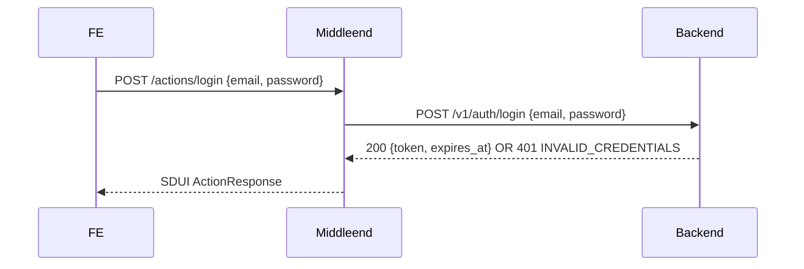

# Security & Auth

## Overview

The backend owns auth: registration, credential check, and JWT issuance (HS256 with a shared secret, configurable TTL). The middleend does not mint tokens — it validates them locally with the shared secret and proxies login/register to the backend.

## Public vs protected routes

| Route                      | Auth required |
|----------------------------|---------------|
| `GET /health`              | no            |
| `GET /screens/login`       | no            |
| `GET /screens/register`    | no (backend returns 403 if registration is disabled) |
| `POST /actions/login`      | no            |
| `POST /actions/register`   | no            |
| Everything else (`/shell`, `/screens/*`, `/actions/*`) | yes |

## Token validation

- Middleware reads `Authorization: Bearer <token>` on protected routes.
- Validates signature (HS256 with `JWT_SECRET`) and `exp` claim locally — no round-trip to the backend.
- Clock-skew leeway on `exp` and `iat`: 30 seconds (configurable).
- On success: sets `user_id` (from `sub` claim) into the request context for logging and downstream use.
- On failure (missing, malformed, bad signature, expired): returns `401` with error code `UNAUTHORIZED`.

## Login flow



### ActionResponse extension: `auth`

The SDUI `ActionResponse` is extended with an optional top-level `auth` field (`AuthInfo`) that any response can include (see `spec/sdui-actions.md`). In the login flow it carries the JWT issued by the backend:

```json
{
  "action": "navigate",
  "target_id": "/shell",
  "feedback": { "type": "snackbar", "id": "login-ok", "props": { "message": "Welcome", "variant": "success" } },
  "auth": {
    "token": "<jwt>",
    "expires_at": "2026-04-15T12:00:00Z"
  }
}
```

Frontend contract: when `auth` is present on a response, the frontend persists `token` and attaches `Authorization: Bearer <token>` on all subsequent requests until expiry, logout, or a new `auth` arrives.

On success, the middleend returns:
- `action: "navigate"`, `target_id: "/shell"` (or the default screen — TBD with login screen spec).
- `feedback`: success snackbar.
- `auth`: token + expiry from backend.

On failure (invalid credentials):
- `action: "none"`.
- `feedback`: error snackbar.
- No `auth`.

## Logout flow

The SDUI `logout` action is handled entirely by the frontend: clears the stored token and navigates to `/screens/login`. The middleend exposes no logout endpoint. Token revocation is out of scope for the MVP (tokens are self-contained and expire by TTL).

## Register flow

Identical structure to login, proxying `POST /v1/auth/register`. Enablement is gated on the backend via `REGISTRATION_ENABLED`; the middleend does not duplicate the check — it relays the backend response (`201` on success, `403 REGISTRATION_DISABLED` when off, `409 EMAIL_ALREADY_EXISTS` on conflict). UI details are TBD in `screens/register.md`.

## Backend call authentication

For every protected middleend→backend call, the middleend forwards the incoming `Authorization` header as-is. The backend validates it with the same shared secret, so user identity is consistent end-to-end.

## Config

| Var                  | Required | Default | Purpose                                  |
|----------------------|----------|---------|------------------------------------------|
| `JWT_SECRET`         | yes      | —       | HS256 secret, must match the backend     |
| `JWT_LEEWAY_SECONDS` | no       | 30      | Clock-skew leeway on `exp` / `iat`       |

Missing `JWT_SECRET` at startup → the app refuses to start.

## Error responses

All auth errors follow the standard middleend error envelope (TBD in `errors.md`). At minimum:

| Status | Code                    | When                                           |
|--------|-------------------------|------------------------------------------------|
| 401    | `UNAUTHORIZED`          | Missing, malformed, invalid, or expired JWT    |
| 401    | `INVALID_CREDENTIALS`   | Relayed from backend on login                  |
| 403    | `REGISTRATION_DISABLED` | Relayed from backend on register               |

## Acceptance criteria

- [ ] Protected endpoint without `Authorization` header returns `401 UNAUTHORIZED`.
- [ ] Protected endpoint with malformed or tampered token returns `401 UNAUTHORIZED`.
- [ ] Protected endpoint with expired token returns `401 UNAUTHORIZED`.
- [ ] Protected endpoint with valid token proceeds and exposes `user_id` downstream.
- [ ] Token within `JWT_LEEWAY_SECONDS` past `exp` is accepted.
- [ ] `POST /actions/login` with valid credentials returns an `ActionResponse` containing an `auth` field (`token`, `expires_at`) and a `navigate` action.
- [ ] `POST /actions/login` with invalid credentials returns an `ActionResponse` with error feedback and no `auth`.
- [ ] `POST /actions/register` relays backend success and error codes unchanged (`201`, `403 REGISTRATION_DISABLED`, `409 EMAIL_ALREADY_EXISTS`).
- [ ] Middleend→backend calls forward the caller's `Authorization` header unchanged.
- [ ] Missing `JWT_SECRET` at startup causes the app to fail to start.
- [ ] `GET /health`, `GET /screens/login`, `POST /actions/login`, `POST /actions/register` are reachable without a token.
